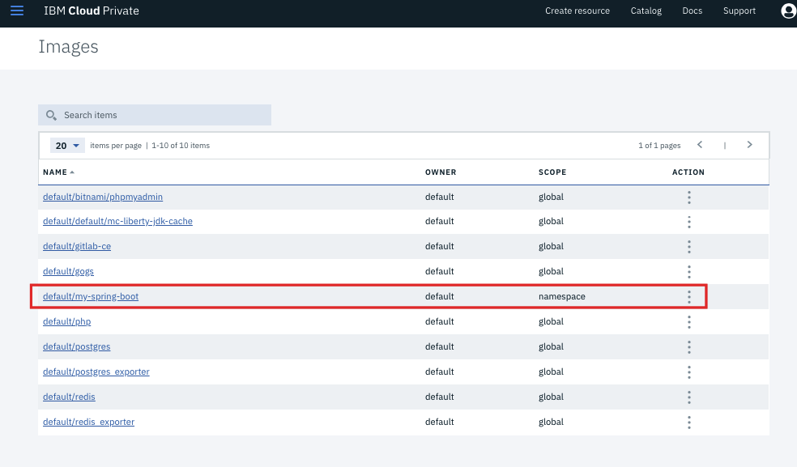

# Private Image Registry 사용하기
본 실습에서는 실습 편의를 위해 spring.io의 간단한 예제 spring 이미지를 사용하며, 
IBM Cloud Private 환경에 이미 구성되어 있는 Private Image Registry를 사용합니다. 
IBM Cloud Private 에 구성된 Private Image Registry는 DockerHub와 동일한 API를 사용하므로, DockerHub를 사용하는 방식과 동일합니다.   

본 실습에서 다룰 내용 

* 이미지 관리
  - DockerHub에 있는 Public 이미지를 Private Image Registry 에 저장 (Push)
  - Private Image Registry 내 이미지 관리 (사용자 권한별, Namespace 별)

* 이미지 사용하기 
  - Deployment 생성 
  - Service 생성 
  - 추가 => Ingress 생성해 보다 편하게 service 사용 

* 위의 내용을 Helm 패키지로 묶어 카탈로그에 등록하고 한번에 배포하기 
  - helm cli 로 만들기 
  - yaml 파일 생성

## Private Image Registry에서 이미지 관리하기 
### DockerHub에 있는 Public 이미지를 Private Image Registry에 저장(Push)
DockerHub 로부터 spring으로 작성된 이미지를 다운로드 후 Private Image Registry에 저장합니다.

1. Spring 이미지를 DockerHub에서 로컬 머신으로  Pull 합니다. 
[Spring.io/gs-spring-boot-docker 이미지](https://hub.docker.com/r/springio/gs-spring-boot-docker)

~~~
docker pull springio/gs-spring-boot-docker:latest
~~~

2. Private Image Registry에 `admin` 계정으로 로그인합니다.  (Username: admin / Password: admin)
~~~
docker login mycluster.icp:8500
~~~

3. Pull 해온 이미지를 Docker의 네이밍 컨벤션에 따라 태그합니다: `mycluster.icp:8500/namespace_name/image_name:image_tag`
~~~
docker tag springio/gs-spring-boot-docker:latest mycluster.icp:8500/default/my-spring-boot:0.1
~~~

4. 태그한 이미지를 Private Image Registry로 Push 합니다. 
~~~
docker push mycluster.icp:8500/default/my-spring-boot:0.1
~~~
<이미지>

5. 웹 콘솔에 admin 계정으로 로그인 후, Private Image Registry에 저장된 이미지를 확인합니다.  * 메뉴 > Manage > Images * 클릭 

  저장된 이미지의 소유자는 `default` 네임스페이스이며, scope 은 해당 네임스페이스로 한정되어 있음을 확인할 수 있습니다. 

### Private Image Registry에 저장된 이미지 가져오기 (Pull) 
1. DockerHub와 마찬가지로 Private Image Registry에 저장된 이미지를 가져올 수도 있습니다. (Pull) 
~~~
docker pull mycluster.icp:8500/default/my-spring-boot:0.1
~~~
* 본 실습에서는 이미 로컬 머신에 이미지를 받은 상태이므로, 새롭게 이미지를 받지는 않습니다.  

### 저장된 이미지 권한 관리하기 
1. Private Image Registry에 `user1`로  로그인합니다. `user1`은 `mynamespace` 에만 권한을 가지고 있습니다.  (Username: user1 / Password: admin)

~~~
docker login mycluster.icp:8500
~~~

2. mynamespace에 저장된 my-spring-boot:0.1 을 pull 해봅니다. 
~~~
docker pull mycluster.icp:8500/default/my-spring-boot:0.1
~~~

user2는 mynamespace 라는 네임스페이스에 권한이 없기에 해당 네임스페이스에 속한 이미지를 사용할 수 없다는 메세지가 뜹니다. 
`Error response from daemon: Get https://mycluster.icp:8500/v2/default/my-spring-boot/manifests/0.1: unauthorized: authentication required`

그럼 이제 이미지의 범위를 변경해 어느 namespace에서나 사용할 수 있도록 수정해보겠습니다. 

### 이미지의 scope 을 `global` 로 변경하기  
1. 웹 콘솔에 admin 계정으로 접속해 *메뉴 > Management > Images* 클릭 

2. *해당 이미지의 Action 클릭 > Change Scope > global`로 수정 

3. user2가 다시 이미지를 pull 해봅니다. 
~~~
docker pull mycluster.icp:8500/default/my-spring-boot:0.1
~~~

4. 이번엔 특정 네임스페이스에 속하지 않는 글로벌 scope으로 설정 되어 있으므로 pull 이 가능합니다. 

## 저장한 이미지를 사용해 컨테이너 실행하기 
- 앞서 저장한 spring 컨테이너 이미지를 사용해 간단한 컨테이너를 Deployment 형태로 실행 
- Deployment를 접근 가능하도록 하기 위해 Service 를 NodePort로 생성 
- 편리하게 접근할 수 있도록 Ingress 설정 

### 저장된 이미지로 Deloyment 만들기 
1. 메뉴 > Workloads > Deployments 클릭

2. 우측 상단의 `Create Deployment` 클릭하여 Deployment 생성 
- General 탭에 내용 입력 
  - Name : spring
  - Namespace : mynamespace (앞서 이미지 scope을 global로 변경했으므로 어떤 namespace 에서나 사용 가능)
  - Replicas : 1
  
- Container settings 탭에 값 입력 
  - Name : spring
  - Image : mycluster.icp:8500/mynamespace/my-spring-boot:0.1 (Public DockerHub 이미지 사용하는 것도 가능)
  - Container port : 8080

3. Create 버튼 클릭 

### Deployment를 외부로 노출하기 위한 Service 생성 
1. 메뉴 > Network Access > Services 클릭 
2. 우측 상단의 `Create Service` 클릭하여 Service 생성 
- General 탭에 내용 입력 
  - Name : spring-svc
  - Namespace : default 
  - Type : NodePort
- Ports
  - Protocol : TCP
  - Name : http 
  - Port : 8080
  - TargetPort : 8080

3. Create 버튼 클릭 
4. 생성된 서비스 클릭
5. Service details 정보에서 Node port 란에 할당된 포트 번호 확인 가능. 해당 포트 번호를 클릭

### Ingress 설정하기 

## 앞에 실행했던 내용은 Helm 패키지로 묶어 카탈로그에 업로드 하기 

1.  사용자 생성 

- image pr-registry에 저장
- 저장된 이미지 확인 
- Deployment로 만들기 
- Service 만들기 
- Ingress 만들기 
