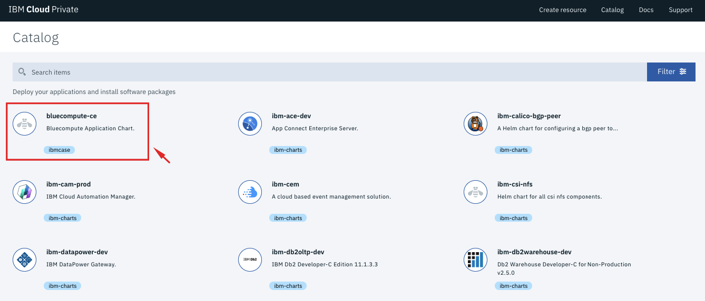
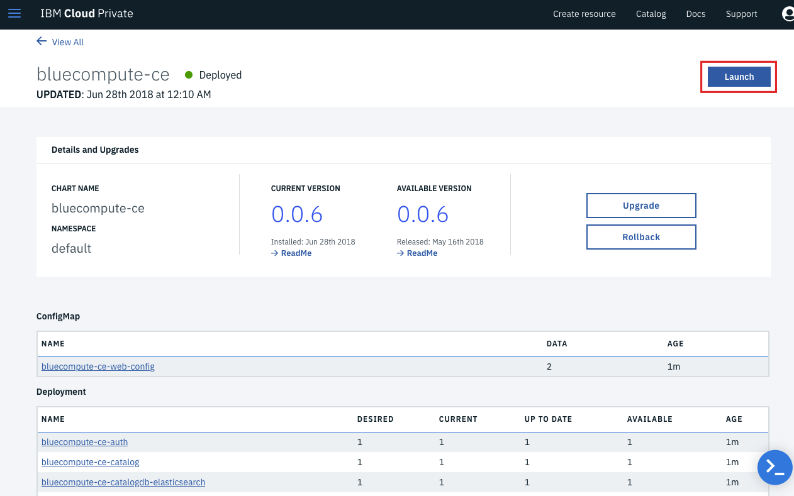

# Helm Chart 로 배포 리소스 패키징하기 

## Blue Compute 마이크로서비스를 Helm Chart로 배포하기

Helm Chart를 카탈로그에 추가하는 방법은 크게 두가지입니다. 

- Helm Chart가 저장되어 있는 repository 추가하기 
  - [Kubernetes stable chart](https://github.com/kubernetes/charts/tree/master/stable)와 [Kubernetes incubator chart](https://github.com/kubernetes/charts/tree/master/incubator) 등 Open source 활용   
  - repository 직접 구성하여 추가
  
- Helm Chart를 직접 작성하여 추가
  - Helm CLI를 통해 직접 Chart를 패키징하여 카탈로그에 추가
  
 이번 시간에는 시간 제약상 Helm Chart의 모든 것을 다루지는 못하고,
 
 맛보기로 정도로 
 Helm repository를 추가하고
 카탈로그에 추가된 Chart를 배포하는 간단한 실습을 해보겠습니다. 
 
 이번에 배포해 볼 Helm Chart는 여러개의 마이크로서비스로 이루어져 있는 Bluecompute 앱입니다. 
 Bluecompute 마이크로서비스 아키텍처입니다. 
 
 

### 1. Helm Chart repository 추가하기 

1. **메뉴 > Manage > Helm Repositories** 클릭
2. 이미 등록된 레파지토리 목록이 있습니다. 참고로 `local-charts`는 IBM Cloud Private 내에 위치한 로컬 레파지토리 입니다. 
3. 우측 상단 `Add repository` 클릭 
 
 
4. 추가할 레파지토리 정보 입력
  - Name : ibmcase
  - URL : https://raw.githubusercontent.com/ibm-cloud-architecture/refarch-cloudnative-kubernetes/master/docs/charts/bluecompute-ce
  
  
  
5. **Sync Repository** 카탈로그 동기화
  
  
6. 동기화 후 우측 상단 버튼을 클릭해 **카탈로그**로 이동
  

7. 이제 **bluecompute-ce** 라는 서비스가 추가되었습니다. 

### 2. 카탈로그에서 Helm Chart 배포하기

1. **bluecompute-ce** 차트를 클릭
  

2. bluecompute 차트를 배포할 때 숙지해야 하는 내용과 옵션들을 명시해 놓은 `README.md` 내용입니다. **Configure** 클릭
  
  
3. 필요한 옵션을 입력
- Release name : bluecompute-ce
- Target namespace : default

그 외 내용은 수정하지 않고 그대로 진행하겠습니다. 

필요시 별도 스토리지를 사용하려면 PersistentVolumeClaim을 명시하면 됩니다. 
그러나 본 튜토리얼에서는 편의를 위해 hostpath를 사용하도록 하겠습니다.

다양한 옵션 값으로부터 볼 수 있듯이 
Auth, Catalog, Catalogelasticsearch 등 여러개의 서비스가 Bluecompute 애플리케이션을 이루는 하나의 패키지로 배포될 것입니다. 

  

4. **Install** 을 클릭해 Chart를 배포
  

5. 배포 후 **View Helm Release**를 클릭해 배포 현황 확인 
  
  
6. Helm Release 정보 확인 
  

약 3-4분 후 모든 pod의 상태가 **AVAILABLE** = 1 이 되면 모든 서비스가 모두 UP 된 것입니다. 

7. 우측 상단 **LAUNCH** 버튼을 클릭해 배포된 서비스를 확인 
  
  

Bluecompute 애플리케이션을 여기저기 투어해보세요. 
각 페이지별로 서로 다른 마이크로서비스가 호출됩니다.  (인증, 카탈로그, 재고 등)

<!--
## 커스텀 Helm Chart 만들어 배포하기 

1. Helm Chart를 생성 
~~~
helm create my-nginx
~~~

2. 생성한 `my-nginx` Chart 는 이런 트리 구조로 되어 있습니다. 

my-nginx/
├── charts
├── Chart.yaml
├── templates
│   ├── deployment.yaml
│   ├── _helpers.tpl
│   ├── ingress.yaml
│   ├── NOTES.txt
│   └── service.yaml
└── values.yaml

_Chart 템플릿에 대해 자세히 알고 싶다면 [Helm Chart Template Getting Started](https://github.com/kubernetes/helm/blob/master/docs/chart_template_guide/getting_started.md) 클릭_

3. 
-->

